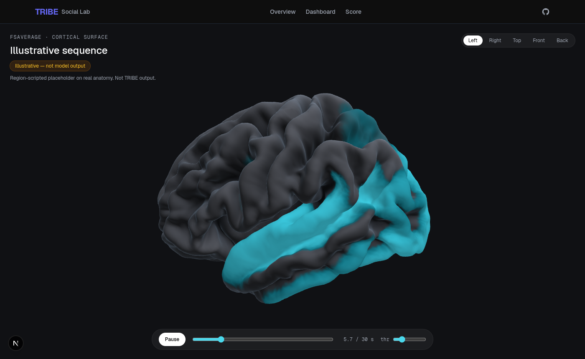
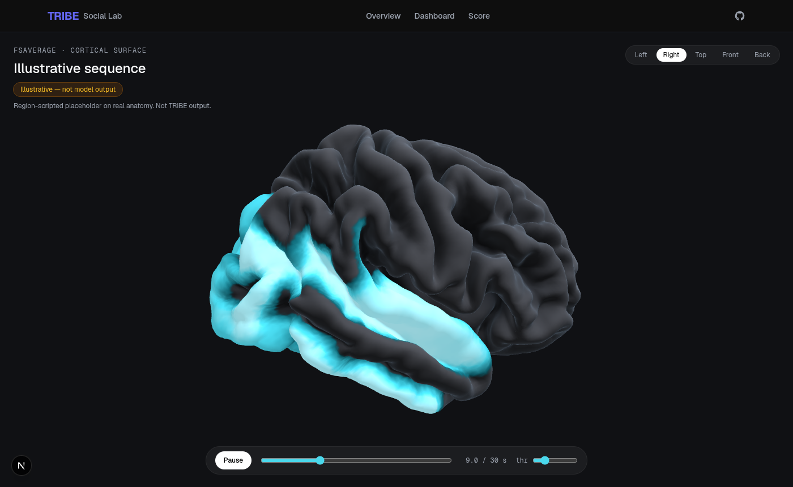
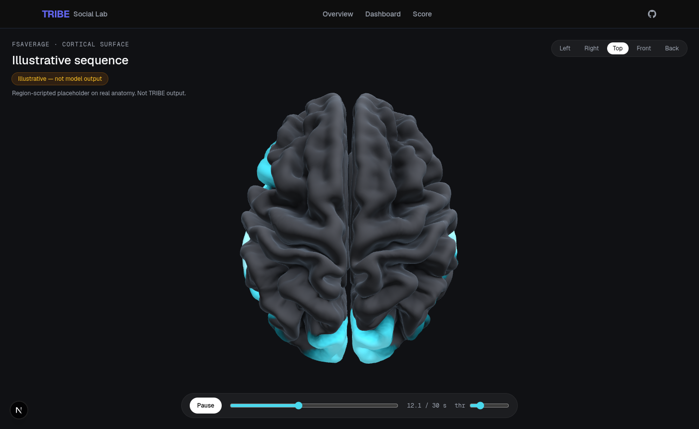

# Cortex view — state of play (2026-10-01)

Handoff for anyone picking up the web experience. Read this before touching the
landing page, the processing page, or anything under `components/brain/`.

## The direction

Decided with Ben 2026-09-29, revised 2026-10-01:

- **Dark theme, x.ai/bot layout.** `business/lanes/design-ref/DESIGN-SPEC.md`
  (git-ignored) maps the x.ai/bot page part by part. Keep its structure, spacing,
  type scale and pill/window language, but on a dark background, not the white
  tokens in that spec.
- **The cortex is the hero (2026-10-01).** This reverses the 2026-09-29 call
  ("scorer is the hero, no 3D in the hero"). The landing hero is the real
  fsaverage cortex, both hemispheres, turning slowly and playing TRIBE v2's
  per-second prediction for the sample clip. Headline, subhead and the two CTAs
  sit beside it (stacked above it on phones).
- **The scorer comes straight after.** The guided scorer replay (`HeroDemo`) is
  the first section under the hero. It was not removed.
- **Brain is the mascot.** It walks the visitor through the process (upload, encode,
  extract, read) in the sections below the hero.
- **Full cortex demonstration on the processing page.** The interactive viewer
  (views, scrubber, threshold) still belongs on the processing/results flow;
  `/cortex` prototypes it.
- **No orb.** No glowing blob, no painted-on glow over a photo-scanned brain,
  no white-matter tracts, deep structures or cut sections, no particles or bloom.
  TRIBE v2's released model predicts only the cortical surface (fsaverage5,
  20,484 vertices), so that's all we render. See `business/canon/DEFENSIBILITY.md`
  for why the orb story does not survive contact with the evidence.

## What exists now

| Piece | Path | What it does |
|---|---|---|
| Exporter | `research/export_cortex.py` | Builds `cortex.glb` (fsaverage6 pial, both hemispheres) + `activity.bin/json`. `--preds X_preds.npy` swaps in real TRIBE output. |
| Assets | `apps/web/public/cortex/` | `cortex.glb` 1.56 MB (meshopt, see below), `activity.bin` (uint8 `[T, 20484]`, 128 = 0), `activity.json` (frames, hz, source, label, note), `cortex-hero.webp` (hero fallback still), `LICENSE-fsaverage.txt`. |
| Mesh + shader | `apps/web/components/brain/CortexBrain.tsx` | Loads the GLB, uploads one TRIBE frame per render tick into a 144×144 float texture, shades gyri/sulci + a cyan activation ramp. Exports `useActivity`, `CortexClock`. |
| Hero scene | `apps/web/components/brain/CortexHeroScene.tsx` | Lazy chunk. Canvas with a yaw/pitch rig (no OrbitControls), camera that fits a fixed world box at any aspect, `Ready` signal once the first real frame is drawn. |
| Hero block | `apps/web/components/landing/CortexHero.tsx` | Static still first, 3D swapped in after idle (WebGL2 only, not on Save-Data). Drag sideways to turn, pause button, time readout, honest caption built from `activity.json`. |
| Shared rig | `apps/web/components/brain/hero-rig.ts` | Three-free rig type + spin constant, so the hero block does not pull three.js into the main bundle. |
| Scene | `apps/web/components/brain/CortexScene.tsx` | `/cortex` canvas, orbit controls, named camera views (left/right/top/front/back). |
| Viewer UI | `apps/web/components/brain/CortexViewer.tsx` | Play/pause, time scrubber, threshold slider, view pills, source badge. |
| Route | `apps/web/app/cortex/page.tsx` | `/cortex` preview. The processing page will embed `CortexViewer` (or a slimmer variant). |
| Old placeholder | `components/brain/BrainHero.tsx`, `BrainScene.tsx` | No longer on `/`. Safe to delete. |

Rendered output (SwiftShader, 1400×860, from the illustrative placeholder era):





## Why it's accurate

- **Real mesh.** fsaverage6 pial surface from nilearn, the same template family
  TRIBE predicts on. It is not a photo-scanned brain, so the folds match TRIBE's
  vertices.
- **No resampling guesswork.** fsaverage meshes are nested icosahedra: the first
  10,242 vertices of each fsaverage6 hemisphere are exactly the fsaverage5
  vertices. The exporter asserts this and it holds to 0.0 difference. Each of
  those vertices shows its own TRIBE value. The in-between vertices blend their
  3 nearest fsaverage5 neighbours on the sphere, weighted by inverse distance.
- **Time is real.** TRIBE outputs one frame per second. The viewer interpolates
  linearly between seconds and plays at 1×.
- **Honest labelling.** `activity.json.source` is `illustrative` or `tribe`.
  Both the viewer and the hero show an amber "Illustrative, not model output"
  badge whenever it is `illustrative`.

## What's on the page now

`activity.bin` is **real TRIBE v2 output** (`source: "tribe"`): 25 one-second
frames for the sample clip `mac_and_cheese.mp4`, an **AI-generated** video,
labelled "Sample creator clip (AI-generated)". Exported with:

```bash
cd research && uv run --no-project --with nilearn --with scipy python export_cortex.py \
  --preds demo_mac_and_cheese_preds.npy --label "Sample creator clip (AI-generated)" \
  --skip-mesh --out ../apps/web/public/cortex
```

The `*_preds.npy` file is git-ignored and stays out of the repo; only the
quantised uint8 frames are committed, the same way the placeholder was.

The hero colours only the stronger responses (`THRESHOLD = 0.4` in
`CortexHero.tsx`, on the exporter's robust-max scale) so the folds stay readable;
at 0.18 (the `/cortex` default) up to 70% of the cortex is lit in the later
seconds of this clip. The caption says "cyan marks the stronger predicted
responses" and "a model prediction for an average viewer, not a recorded scan".

## Hero fallback still

`cortex-hero.webp` is what first paint, reduced-motion visitors without WebGL2,
and Save-Data visitors see. It is a capture of the live hero at `YAW0`,
`STILL_T = 12 s`, at exactly the `FRAME_W:FRAME_H` (2.2 : 2.0) aspect the camera
fits, with a transparent background, so `object-fit: contain` lines it up with
the canvas at any width. **Re-capture it whenever `activity.*`, the threshold,
the shader or the framing changes**: load `/` with reduced motion emulated, set
the stage `[role=img]` to 1320×1200 px, hide everything else, screenshot the
element with `omitBackground`, and save as WebP (q≈84).

## GLB compression

`cortex.glb` went through `npx @gltf-transform/cli meshopt cortex.glb cortex.glb
--level medium` (4.75 MB → 1.56 MB; ~0.98 MB gzipped). Checked by decoding both
files and matching vertices: `_FSA5_IDX` is untouched (gltf-transform skips it as
out of [-1, 1] and keeps uint16), triangles identical, `_FSA5_W` / `_SULC` /
positions within 1.4e-4 (12/14-bit quantisation). drei's `useGLTF` ships the
meshopt decoder, and `CortexBrain` keeps the node transform that
`KHR_mesh_quantization` relies on. `export_cortex.py` still writes the raw GLB;
re-run the meshopt step after any mesh export.

## Open items / gates

1. **Licensing.** TRIBE v2 is CC-BY-NC-4.0 and its output is now on the landing
   page, which also lists pricing. Check that against `NOTICE` and
   `business/canon/MODEL-LICENSE-DECISION.md` before the page is used
   commercially. fsaverage attribution and the FreeSurfer license terms are in
   `NOTICE` and `apps/web/public/cortex/LICENSE-fsaverage.txt` (done 2026-10-01).
2. **Processing page integration.** Embed the viewer in `components/scorer/JobProgress.tsx`.
   It needs per-job preds from the API, which don't exist yet (the API returns ROI
   scores, not vertex arrays).
3. **Old placeholder.** Delete `BrainHero.tsx` / `BrainScene.tsx` once nothing
   references them.

## Dev notes

- `/mnt/external` is now a local ext4 disk (it was an sshfs mount on 2026-09-29,
  when `next dev` took 8 minutes to boot). `next dev` starts in under a second
  there today; the old rsync-to-a-local-mirror workaround is no longer needed.
- The dev server is reached over the tailnet, so `next.config.ts` lists
  `allowedDevOrigins: ['benderman', '100.80.167.1']`.
- Headless Chrome may have no WebGL. For screenshots, launch it with
  `--use-angle=swiftshader --enable-unsafe-swiftshader`.
